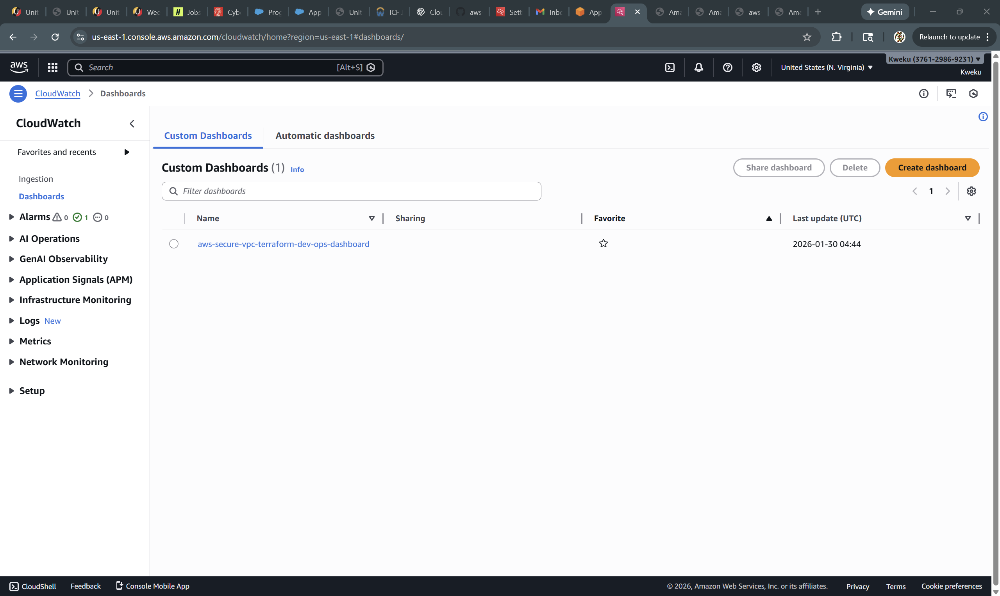

# aws-secure-vpc-terraform
Secure, multi-environment AWS VPC architecture built with Terraform

This repository demonstrates a production-grade AWS networking foundation using Terraform Infrastructure as Code (IaC). It implements isolated dev, staging, and prod environments, each with its own VPC, subnets, NAT gateway, and remote state management.

The project follows real-world cloud engineering best practices: modular Terraform design, remote state with locking, environment separation, and security-first defaults.

Architecture Overview
Each environment (dev, staging, prod) deploys:
A dedicated AWS VPC
Public subnets (for internet-facing resources)
Private subnets (for internal workloads)
Internet Gateway
NAT Gateway (single NAT for cost optimization)
Route tables and subnet associations
Environment-specific tagging
Terraform state is stored remotely in S3 with DynamoDB state locking to support team workflows and prevent concurrent changes.

Repository Structure
aws-secure-vpc-terraform/
│
├── backend/
│   └── bootstrap/          # Creates S3 + DynamoDB for remote state
│
├── modules/
│   └── vpc/                # Reusable VPC Terraform module
│
├── environments/
│   ├── dev/
│   ├── staging/
│   └── prod/               # Environment-specific configurations
│
├── docs/                   # (Reserved for diagrams & documentation)
└── README.md

Environments
Each environment is fully isolated and uses its own remote state file.

| Environment | CIDR Block   | Purpose               |
| ----------- | ------------ | --------------------- |
| dev         | 10.10.0.0/16 | Development & testing |
| staging     | 10.20.0.0/16 | Pre-production        |
| prod        | 10.30.0.0/16 | Production            |

Remote State & Locking
Remote state is configured using:
Amazon S3 — Terraform state storage
Amazon DynamoDB — state locking & concurrency control
This prevents:
State corruption
Accidental concurrent applies
Local state drift
Each environment uses a unique state key, ensuring complete separation.

How to Deploy
1️. Bootstrap remote state (one time)
cd backend/bootstrap
terraform init
terraform apply

2️. Deploy an environment (example: dev)
cd environments/dev
terraform init
terraform plan
terraform apply
Repeat for staging and prod.

Outputs
Each environment exports useful outputs:
vpc_id
public_subnet_ids
private_subnet_ids

Example:
terraform output
These outputs can be consumed by downstream modules (EC2, EKS, RDS, etc.).

Security Considerations
No inbound SSH access by default
Private subnets route outbound traffic via NAT
State locking prevents unsafe concurrent changes
Strict tagging for environment and ownership
Designed to support SSM-only EC2 access (future enhancement)

Design Decisions
Single NAT Gateway per environment to balance cost and availability
Module-based design for reuse and maintainability
Environment isolation instead of workspaces for clearer blast radius
Remote state from day one (non-negotiable in real teams)

Roadmap (Planned Enhancements)
SSM-only EC2 instances (no SSH)
VPC Interface Endpoints (SSM, EC2Messages)
Architecture diagram
CI/CD validation with terraform fmt and terraform validate

Tools Used
Terraform
AWS (VPC, EC2, S3, DynamoDB)
AWS CLI
Visual Studio Code

👤 Author
Richard Addae
Cloud & Security Engineering Focus
Terraform • AWS • Infrastructure as Code

## Operations (CloudWatch)

After deployment, Terraform creates an operations dashboard and exposes it as an output:

- `ops_dashboard_name` = **aws-secure-vpc-terraform-dev-ops-dashboard**

Open it in AWS Console:
CloudWatch → Dashboards → **aws-secure-vpc-terraform-dev-ops-dashboard**

### Monitoring coverage
This dashboard includes:
- ASG CPU utilization
- ASG desired vs in-service capacity
- ALB request count
- ALB target response time
- ALB 4XX/5XX (ELB + Target)
- ALB healthy vs unhealthy hosts
- Alarm status widget (alarms tied directly to the dashboard)

### Screenshot

## Quick Test

After `terraform apply`, open the ALB URL in your browser:

- `alb_dns_name` output → `http://<alb_dns_name>`

Expected response from the EC2 instances:
`OK: aws-secure-vpc-terraform-dev`