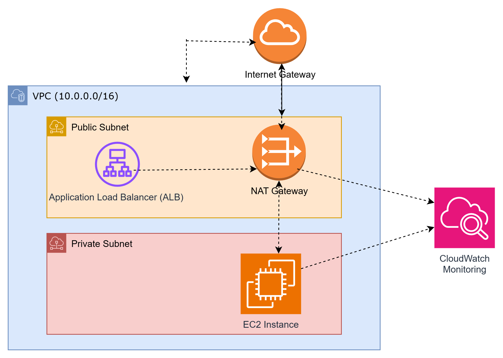
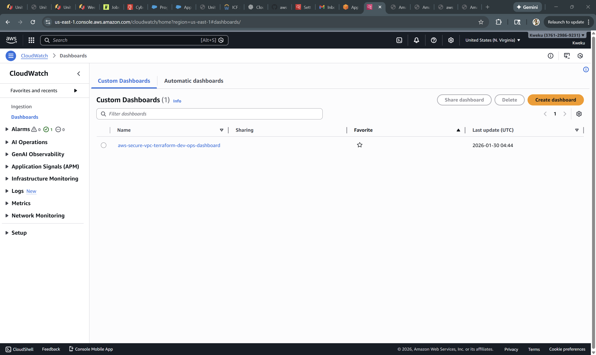

🚀 AWS Secure Multi-Environment VPC (Terraform)

Production-grade, secure AWS networking infrastructure built using Terraform.
Implements fully isolated dev, staging, and production environments with secure VPC design, remote state management, and CloudWatch monitoring.

🔥 Key Features

Multi-environment architecture (dev / staging / prod)

Secure VPC with public & private subnets

Remote Terraform state (S3 + DynamoDB locking)

Modular, reusable Terraform design

CloudWatch monitoring & alerting

High availability across multiple Availability Zones

Security-first architecture design

🎯 What This Project Demonstrates

Designing secure AWS network architectures

Building reusable Terraform modules

Managing infrastructure across multiple environments

Implementing remote state and team-safe workflows

Monitoring systems using CloudWatch

🏗️ Architecture Diagram

---

📌 Project Overview

This project demonstrates how to build a secure, scalable, production-ready AWS networking foundation using Infrastructure as Code (Terraform).

Each environment is fully isolated and includes:

Dedicated VPC

Public and private subnets

Internet Gateway & NAT Gateway

Route tables and subnet associations

Remote state management

🧠 Architecture Overview

Each environment (dev, staging, prod) includes:

Dedicated VPC

Public subnets (internet-facing resources)

Private subnets (internal workloads)

Internet Gateway

NAT Gateway (cost-optimized)

Route tables and subnet associations

Remote state stored in S3 with DynamoDB locking

🗂️ Repository Structure
aws-secure-vpc-terraform/
├── backend/
│   └── bootstrap/        # Creates S3 + DynamoDB for remote state
├── modules/
│   └── vpc/              # Reusable VPC Terraform module
├── environments/
│   ├── dev/
│   ├── staging/
│   └── prod/             # Environment-specific configs
├── docs/
│   ├── architecture.png
│   └── screenshots/
│       └── ops-dashboard.png
└── README.md

🌍 Environments
EnvironmentCIDR BlockPurpose
dev	     10.10.0.0/16	 Development & testing
staging	 10.20.0.0/16	 Pre-production
prod	   10.30.0.0/16	 Production

🔐 Remote State & Locking

Terraform state is stored remotely using:

Amazon S3 — state storage

Amazon DynamoDB — state locking

This prevents:

State corruption

Concurrent deployments

Local state drift

⚙️ Deployment
1️⃣ Bootstrap remote state (one-time)
cd backend/bootstrap
terraform init
terraform apply
2️⃣ Deploy environment (example: dev)
cd environments/dev
terraform init
terraform plan
terraform apply
📊 Monitoring (CloudWatch)

The project includes a CloudWatch dashboard with:

ASG CPU utilization

ALB request count

Target response time

4XX / 5XX error metrics

Health checks

Alarm status tracking

### Screenshot

🧪 Quick Test

After deployment:

terraform output alb_dns_name

Open in browser:

http://<alb_dns_name>

Expected response:

OK: aws-secure-vpc-terraform-dev
🔐 Security Considerations

No direct SSH access

Private subnets for application workloads

Controlled outbound access via NAT Gateway

Remote state locking for safe deployments

Environment isolation to reduce blast radius

🧠 Design Decisions

Single NAT Gateway per environment (cost optimization)

Modular Terraform design for reuse

Separate environments instead of workspaces (clear isolation)

Remote state implemented from the start

🚀 Roadmap

SSM-only EC2 access (no SSH)

VPC Interface Endpoints (SSM, EC2Messages)

CI/CD pipeline (GitHub Actions)

Terraform validation (fmt, validate)

🛠️ Tech Stack

AWS (VPC, EC2, ALB, S3, DynamoDB, CloudWatch)

Terraform

AWS CLI

👤 Author

Richard Addae
Cloud & Security Engineering Focus
Terraform • AWS • Infrastructure as Code
